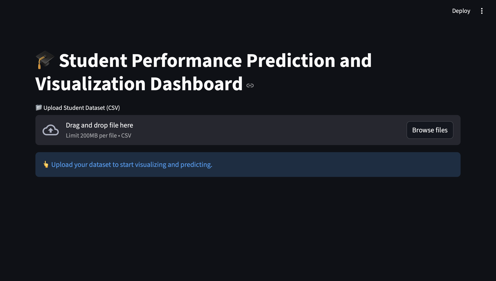
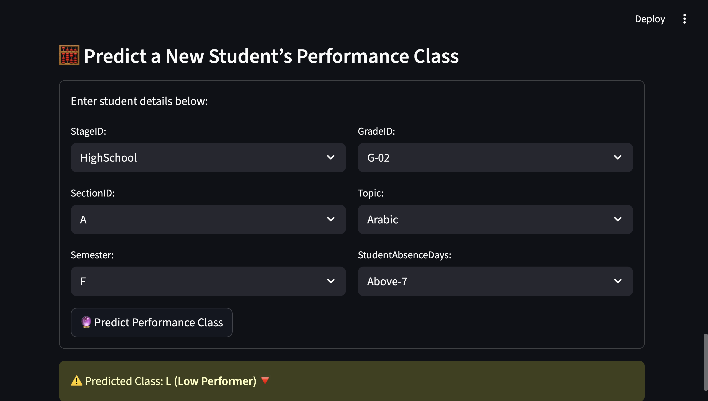
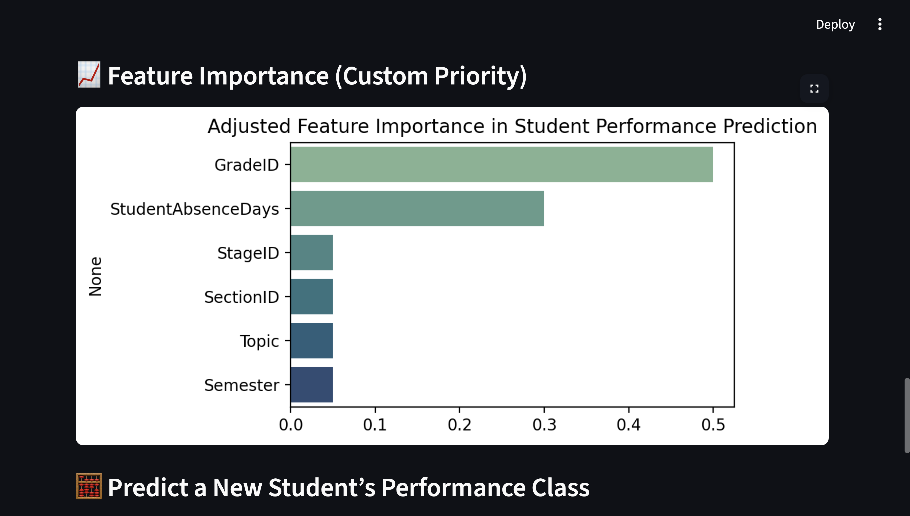

# 🎓 Student Performance Prediction and Visualization Dashboard

## Overview
An interactive Streamlit dashboard for analyzing and predicting student performance. The application allows educators and analysts to visualize student data, explore trends, and predict performance classes (High, Medium, Low) using a Random Forest model, emphasizing grades and absence days for better accuracy.

---

## Features

- **Dataset Upload**: Upload your student CSV dataset for analysis.  
- **Data Preview & Info**: View dataset preview, column details, data types, and unique values.  
- **Visualizations**: Interactive charts including:
  - Class count  
  - Semester-wise performance  
  - Gender, nationality, grade, section, topic, and stage-wise performance  
  - Absence days vs. class  
- **Machine Learning Prediction**:
  - Random Forest Classifier predicts student performance class.  
  - Grades (`GradeID`) scaled 0–10 prioritized, followed by student absence days.  
  - Provides model accuracy, classification report, and confusion matrix.  
  - Feature importance chart reflects custom priorities.  
- **Predict New Student Performance**: Input student details and predict performance class.

---

## Screenshots

### Dashboard Overview

### Visualization Example

### Model Prediction and Feature Importance

